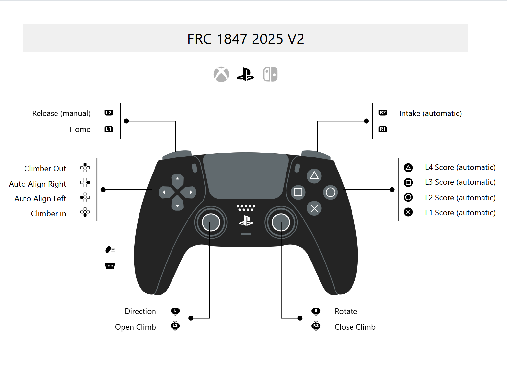

[PS5 Button Layout](https://www.padcrafter.com/index.php?templates=FRC+1847+2025+V2&plat=1&rightTrigger=Intake+%28automatic%29&leftTrigger=Release+%28manual%29&leftStick=Direction&rightStick=Rotate&dpadDown=Climber+in&dpadLeft=Auto+Align+Left&dpadRight=Auto+Align+Right&dpadUp=Climber+Out&leftBumper=Home&rightBumper=&yButton=L4+Score+%28automatic%29&aButton=L1+Score+%28automatic%29&bButton=L2+Score+%28automatic%29&xButton=L3+Score+%28automatic%29&rightStickClick=Close+Climb&leftStickClick=Open+Climb&col=%23242424%2C%23606A6E%2C%23FFFFFF)

